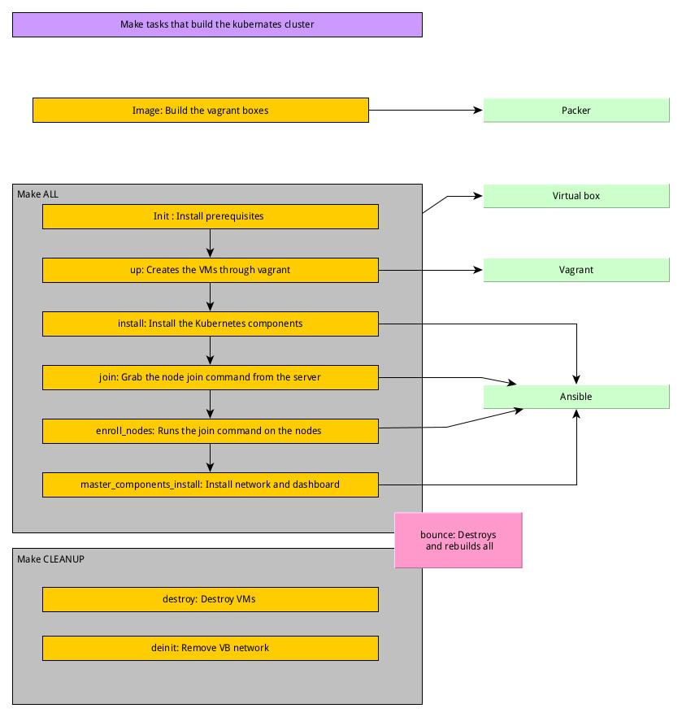

# Building Kubernetes network on virtualbox

This is a part of a run through of the creation of a kubernetes cluster from scratch.
Now, as more and more Kubernetes is cloud native and does not offer any in depth knowledge of the 
configuration it can be good to create the stack from scratch to see what parts are involved. 
This example makes use of vanilla kubernetes to expose the core ideas of the platform. 

This set was set up for teaching the author the basic setup and will evolve over time to include more extra ideas like securing, 
sidecars and monitoring. 


# Stack

- Archlinux rolling
- Virtual box 6.x
- Vagrant 2.2.x
- Packer 1.7.x

# Install
These commands do most of the installation
Create two boxes from the ubuntu packer scripts. 

`corevm_gui` based on ubuntu-desktop
`corevm_node` based on ubuntu-server 

Get the packer scripts from `https://github.com/jvautier/packer-ubuntu` 

After the build create the vagrant boxes by: 

```bash
vagrant box add corevm_node builds/ubuntu-20.04-node.virtualbox.box
vagrant box add corevm_gui builds/ubuntu-20.04-desktop.virtualbox.box
```

```bash
make init
make up
make install
```
Now from the master installation ansible commandline results get the join command, it will look like: 
```bash
kubeadm join 192.168.51.2:6443 --token tk2fjv.6i9ihz55gyw6xiuj --discovery-token-ca-cert-hash sha256:77e4cf0e937c547fd60f7bbdfa72b8582702dd8189a0fc6589c93107aea99903
```

Place it in the `kubernetes/ansible/enroll-nodes.yaml` file and then run 
```bash
make enroll
```
This will enroll the nodes to the master, but there is no network yet. 

Run the 
```bash
make master_components_install
```
to install the network and the dashboard. 

To run all this in one go run: 

```bash
make all 
```

The tasks are defined like this: 



## Credentials dashboard
Get the account for the dashboard by: 

### Create a service account
(Done by the `make master_components_install` task)
```bash
kubectl create serviceaccount dashboard-admin-sa
```

### Bind the account to the dashboard
(Done by the `make master_components_install` task)
```bash
kubectl create clusterrolebinding dashboard-admin-sa --clusterrole=cluster-admin --serviceaccount=default:dashboard-admin-sa
```

### Get the token
(You need to get this manually)
```bash
kubectl get secrets
```

### Select the entry
(You need to get this manually)
```bash
kubectl describe secret dashboard-admin-sa-token-<random_value>
```

Now get the JWT token (token:) and log in.


If you want to rerun the vagrant init you can run:

```bash
make provision
```
However, this does not rerun the ansible scripts. 


And clean up with

```bash
make cleanup
```
which will delete the stack and remove the network from virtualbox.


# Post install
Parts are done by the `master_components_install.yml` scripts. 


## Manager
After installation run on the manager, this is the result of the init:
```bash
sudo kubeadm token create

ahw5ao.uyjl3hehqhvpy1l8
```
You get output from the ansible script for the manager like (Done by the `make enroll` task, see above)

```bash
kubeadm join k8s-cluster.phiroict.co.nz:6443 --token qfyvrc.s2ddam3puw9lq5p8 \\",
        "\t--discovery-token-ca-cert-hash sha256:ee5c332d4181c4ba7e4310da1e83376ceb2dd1e8e1d15665354c575f928df680
```

## Node
Now join the cluster for each of the nodes  (Done by the `make enroll` task)

```bash
sudo kubeadm join k8s-cluster.phiroict.co.nz:6443 --token qfyvrc.s2ddam3puw9lq5p8 --discovery-token-ca-cert-hash sha256:ee5c332d4181c4ba7e4310da1e83376ceb2dd1e8e1d15665354c575f928df680
```

# Usage

# Manager - Control pane

At the moment we have one control pane (the manager) and four nodes.
On the `https://computingforgeeks.com/deploy-kubernetes-cluster-on-ubuntu-with-kubeadm/` as examples how to test the stack.


Now install the dashboard: 
```bash
wget https://raw.githubusercontent.com/kubernetes/dashboard/master/aio/deploy/recommended.yaml
mv recommended.yaml kubernetes-dashboard-deployment.yml
kubectl apply -f  kubernetes-dashboard-deployment.yml
```

Now in the master run
```bash
kubectl proxy
```


Install a network manager, Flannel is a good default, do this after the dashboard release as it needs to run on the master and not on the nodes:

```bash
kubectl apply -f kube-flannel.yml

# Check with
watch kubectl get pods --all-namespaces
```


And forward port 8001 to the host from virtualbox 

Now open the dashboard with: 

```bash
http://localhost:8001/api/v1/namespaces/kubernetes-dashboard/services/https:kubernetes-dashboard:/proxy/.
```

Change the deployment file by set a NodePort or get the one from  `kubernetes/k8s-dashboard.yaml`

# Details

Here technical details about this stack is shown.

## Ansible

## Virtual box configuration with Vagrant


## Usage

Log in to all the nodes.

- Get terminator
- Start four termials
- Log in with
```bash
ssh vagrant@localhost -p 220x # Where x is a element of {0,1,2,3}
```

## Reboot

After all the servers are back, resstart the kubelet by
```bash
sudo systemctl restart kubelet
```


# Training videos

`https://www.youtube.com/watch?v=YXfLAWGTI38`
## Cheat sheet 

`https://kubernetes.io/docs/reference/kubectl/cheatsheet/`
## Setup sites
```text
https://computingforgeeks.com/deploy-kubernetes-cluster-on-ubuntu-with-kubeadm/
https://computingforgeeks.com/how-to-install-kubernetes-dashboard-with-nodeport/
https://kubernetes.io/docs/setup/production-environment/tools/kubeadm/install-kubeadm/#configure-cgroup-driver-used-by-kubelet-on-control-plane-node
https://kubernetes.io/docs/reference/setup-tools/kubeadm/kubeadm-token/
```


# Application and routing

Need to have: Kubernetes cluster with one master and four nodes

Create and setup the dashboard:

`https://www.replex.io/blog/how-to-install-access-and-add-heapster-metrics-to-the-kubernetes-dashboard`
In short:


Install the prometheus stack by using helm, and visual code for editing

```bash
sudo snap install code helm -–classic
```


# Search for a grafana chart

```bash
helm search hub grafana -o json
```

# Get the chart from the json result. Install it and check its installation


```bash
helm repo add prometheus-community https://prometheus-community.github.io/helm-charts
helm repo update
helm install mytrucking-monitoring prometheus-community/kube-prometheus-stack
kubectl --namespace default get pods -l "release=mytrucking-monitoring"
```


Setting up an ingress point we install the nginx plugin ingress as described here:

`https://kubernetes.github.io/ingress-nginx/deploy/`


When that is done :

`https://kubernetes.io/docs/concepts/services-networking/ingress/`

Create an ingress for a service


Now get the the url to get to the service:


```bash
kubectl describe service/mytrucking-monitoring-grafana
```


# Returns something like
```text
Name:              mytrucking-monitoring-grafana
Namespace:         default
Labels:            app.kubernetes.io/instance=mytrucking-monitoring
                   app.kubernetes.io/managed-by=Helm
                   app.kubernetes.io/name=grafana
                   app.kubernetes.io/version=8.0.1
                   helm.sh/chart=grafana-6.12.1
Annotations:       meta.helm.sh/release-name: mytrucking-monitoring
                   meta.helm.sh/release-namespace: default
Selector:          app.kubernetes.io/instance=mytrucking-monitoring,app.kubernetes.io/name=grafana
Type:              ClusterIP
IP Family Policy:  SingleStack
IP Families:       IPv4
IP:                10.107.137.163
IPs:               10.107.137.163
Port:              service  80/TCP
TargetPort:        3000/TCP
Endpoints:         10.244.3.7:3000
Session Affinity:  None
Events:            <none>
```


The endpoint is what you use on the master or wherever you forwarded this to.


This assumes the proxy is running (You started that for the dashboard)

## MySQL installation 
Via the helm application install the mysql database 

MySQL installation

```bash
helm repo add bitnami https://charts.bitnami.com/bitnami
```


```bash
helm install mytrucking-database bitnami/mysql --values settings-mysql.yml
```


```yaml
---
auth:
    rootPassword: s3cret!
    username: demo
    password: demopass
    replicationUser: replicator
    replicationPassword: replicat0r 
```


The settings are from the installation page https://artifacthub.io/packages/helm/bitnami/mysql

Get the password later with


echo Password : $(kubectl get secret --namespace default mytrucking-database-mysql -o jsonpath="{.data.mysql-root-password}" | base64 –decode) 

Create persistent storage so the mysql claim can be created against it. For instance 10GiB. You need a folder created on all nodes to be able to do that. 


Login with 
```bash
# Start an instance
kubectl run mytrucking-database-mysql-client --rm --tty -i --restart='Never' --image  docker.io/bitnami/mysql:8.0.25-debian-10-r16 --namespace default --command -- bash
# COnnect to the database
mysql -h mytrucking-database-mysql.default.svc.cluster.local -uroot -p my_database
# Get the password
ROOT_PASSWORD=$(kubectl get secret --namespace default mytrucking-database-mysql -o jsonpath="{.data.mysql-root-password}" | base64 --decode)
# Change a password
helm upgrade --namespace default mytrucking-database bitnami/mysql --set auth.rootPassword=$ROOT_PASSWORD
```


# Istio

Service mesh between services. 

Open the kiali dashboard by: 

```bash
istioctl dashboard kiali
```